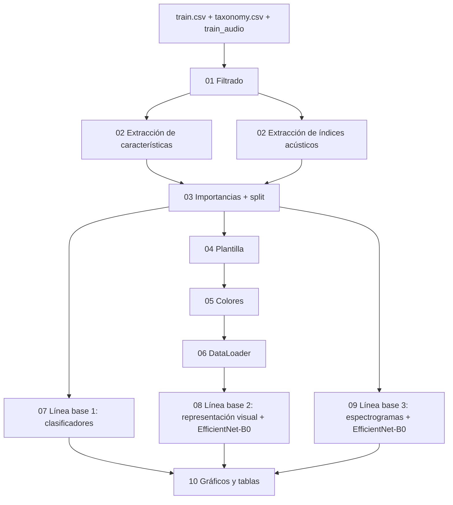

# Mapeo visual de descriptores acústicos

Clasificación de especies de aves a partir de sus cantos, usando los audios de la competencia [BirdCLEF 2025](https://www.kaggle.com/competitions/birdclef-2025).

El proyecto propone una **representación visual nueva**: los descriptores acústicos de cada audio (características espectrales e índices acústicos) se convierten en una imagen en escala de grises. En esa imagen, cada descriptor ocupa un bloque cuyo tamaño depende de su importancia y cuyo color depende de su valor en ese audio. Las imágenes se clasifican con EfficientNet-B0.

La propuesta se compara con dos líneas base:

| Línea | Entrada | Modelo |
|---|---|---|
| Línea base 1 | Valores de los descriptores (tabla) | 11 clasificadores tradicionales de scikit-learn |
| Línea base 2 | Representación visual de los descriptores | EfficientNet-B0 (transfer learning) |
| Línea base 3 | Mel-espectrograma del audio | EfficientNet-B0, código base de la competencia en Kaggle |

Proyecto desarrollado en el Semillero de Inteligencia Artificial del ITM (Medellín), grupo MIRP (Máquinas Inteligentes y Reconocimiento de Patrones), y presentado en el 3CCBE.

---

## Contenido del repositorio

| Archivo | Qué hace | Pregunta por teclado |
|---|---|---|
| `01_filtrado.py` | Une `train.csv` con `taxonomy.csv`, quita duplicados, asigna la etiqueta de cada especie y filtra por clase, duración y colección. | Clase, duración, colección |
| `02_extraccion_caracteristicas.py` | Extrae 9 características espectrales con librosa (a 22.050 Hz) y las normaliza a [0, 1]. | Mínimo de audios por especie |
| `02_extraccion_indices_acusticos.py` | Extrae los índices acústicos con scikit-maad (frecuencia original del audio) y los normaliza a [0, 1]. | Mínimo de audios por especie |
| `03_metricas.py` | Calcula la importancia de cada descriptor, selecciona los descriptores y crea el split único de entrenamiento y prueba. | Método de importancia, división del split, semilla |
| `04_plantilla.py` | Construye la plantilla geométrica: el bloque de cada descriptor según su importancia. | Tamaño de la imagen en píxeles |
| `05_colores.py` | Pinta la plantilla con el valor de cada descriptor (escala de grises) y guarda una muestra de 5 audios. | — |
| `06_Data_Loader.py` | `PlantillaDataset` de PyTorch: entrega la imagen y la etiqueta de cada audio, generadas en memoria. | — |
| `07_Linea_base_1_Clasificadores.py` | Línea base 1: entrena y evalúa los 11 clasificadores tradicionales. | — |
| `08_Linea_base_2_descriptores.py` | Línea base 2: entrena y evalúa EfficientNet-B0 con la representación visual. | — |
| `09_Linea_base_3_espectrogramas.py` | Línea base 3: entrena y evalúa EfficientNet-B0 con mel-espectrogramas. | — |
| `10_graficos.py` | Lee los resultados de las tres líneas y genera las gráficas, las matrices de confusión y las tablas. | — |

Todos los códigos leen las columnas de las tablas por **posición**, no por nombre. Cada código busca solo el resultado más reciente del código anterior, así que solo hay que ejecutarlos en orden.

---

## Flujo del proyecto



---

## Metodología

### 1. Filtrado (`01_filtrado.py`)
- Une `train.csv` y `taxonomy.csv` por el código de la especie.
- Elimina los audios repetidos (mismo identificador de archivo) y conserva el primero.
- Asigna a cada especie una etiqueta numérica en orden alfabético.
- Filtra por clase (Aves, Amphibia, Insecta, Mammalia o combinaciones), duración y colección (Xeno-canto, iNaturalist, CSA o combinaciones).

### 2. Extracción y normalización (`02_*.py`)
- Antes de extraer, se quitan las especies con menos audios que el mínimo elegido (en el estudio, 15). Así la normalización se calcula solo con los audios con los que se trabaja.
- **Características** (librosa, audio remuestreado a 22.050 Hz, `n_fft = 2048`, `hop_length = 512`):
  - Frecuencia mínima y máxima (energía acumulada del 5 % y del 95 %, como en Raven Pro).
  - Centroide espectral, ancho de banda, rolloff, contraste espectral, planitud (flatness), RMS y tasa de cruces por cero (ZCR).
- **Índices acústicos** (scikit-maad, frecuencia original del audio): índices temporales y espectrales. `LEQt` se excluye porque da valores inválidos y quedan 59 índices.
- Cada columna se normaliza a [0, 1] con `MinMaxScaler`.

### 3. Importancia, selección y split (`03_metricas.py`)
- **Importancia** con ReliefF (`n_neighbors = 100`), el método del estudio. También se puede elegir Random Forest, Extra Trees, información mutua o ANOVA F.
- **Selección** de descriptores:
  1. Las importancias se normalizan: se resta el mínimo y se divide por la suma.
  2. Se eliminan los descriptores con importancia 0.
  3. Si el total no es múltiplo de 3, se eliminan los de menor importancia hasta llegar al múltiplo de 3 inferior. Esto es necesario porque la plantilla ubica los bloques en filas de 3.
  4. Las importancias restantes se vuelven a normalizar para que sumen 1.
- **Split único estratificado** (por defecto 70/30), compartido por las tres líneas para que todas se evalúen con los mismos audios.

### 4. Representación visual (`04_plantilla.py`, `05_colores.py`, `06_Data_Loader.py`)
- **Plantilla:** los descriptores se agrupan en filas de 3 bloques. El alto de cada fila es la suma de las importancias de sus 3 descriptores, y el ancho de cada bloque es su importancia dividida por ese alto. Así el área de cada bloque es proporcional a su importancia. Si al convertir a píxeles algún bloque queda sin píxeles, se eliminan los 3 descriptores de menor importancia y se rehace la plantilla, con un aviso.
- **Color:** cada bloque se pinta con un solo gris, `gris = 1 − valor normalizado`, sobre fondo blanco. Valor 0 queda blanco y valor 1 queda negro.
- **DataLoader:** las imágenes se pintan en memoria, píxel por píxel, y se entregan como tensor `(1, alto, ancho)` junto con la etiqueta de la especie.

### 5. Clasificación
- **Línea base 1:** Regresión logística, KNN, SVM, Árbol de decisión, Random Forest, Extra Trees, AdaBoost, Gradient Boosting, LDA, Naive Bayes y ANN (una capa oculta de 100 neuronas), casi todos con los parámetros por defecto de scikit-learn.
- **Línea base 2:** EfficientNet-B0 preentrenada con ImageNet.
  - La primera convolución pasa a 1 canal, con el promedio de los pesos RGB.
  - Solo se entrenan la primera convolución y el clasificador (Dropout 0,3).
  - Adam, tasa de aprendizaje 0,001, lotes de 20, 15 épocas, imagen de 128 × 128 px.
- **Línea base 3:** código base de la competencia en Kaggle, adaptado para correr localmente y usar el mismo split:
  - EfficientNet-B0 de `timm` sobre mel-espectrogramas de 5 s a 32 kHz.
  - BCEWithLogitsLoss, AdamW (tasa de aprendizaje 0,0005), CosineAnnealingLR, mixup, lotes de 32 y 10 épocas.

### 6. Medidas
En entrenamiento y en prueba se reportan **AUC** (una especie contra todas, promediado), **accuracy**, **recall macro** y **F1 macro**. Recall y F1 macro dan el mismo peso a todas las especies. En las líneas 2 y 3 el resultado que se reporta es el de la última época.

---

## Requisitos

- Python 3.14
- `numpy`, `pandas`, `matplotlib`, `soundfile`, `librosa`
- `scikit-learn`, `scikit-maad` (1.5.2), `skrebate`
- `torch`, `torchvision`, `timm`, `opencv-python`, `tqdm`

```bash
pip install numpy pandas matplotlib soundfile librosa scikit-learn scikit-maad==1.5.2 skrebate torch torchvision timm opencv-python tqdm
```

---

## Datos

Los audios **no** están en este repositorio. Se descargan de la [competencia BirdCLEF 2025](https://www.kaggle.com/competitions/birdclef-2025/data) y se organizan así dentro de la carpeta del proyecto:

```
<CARPETA_BASE>/
├── DATOS/
│   ├── train.csv
│   └── taxonomy.csv
├── train_audio/          # una carpeta por especie con sus audios .ogg
└── salidas/              # la crean los códigos
```

---

## Configuración

La ruta del proyecto se cambia en el **Bloque 0** de cada código, en la variable `CARPETA_BASE`:

- `01_filtrado.py`
- `02_extraccion_caracteristicas.py`
- `02_extraccion_indices_acusticos.py`
- `03_metricas.py`
- `04_plantilla.py`
- `05_colores.py`. De aquí toman la ruta `06_Data_Loader.py`, `07`, `08`, `09` y `10`.

Además, `09_Linea_base_3_espectrogramas.py` tiene en su clase `CFG` tres rutas fijas que hay que cambiar: `OUTPUT_DIR`, `train_datadir` y `taxonomy_csv`.

Todos los archivos deben estar en la misma carpeta, porque unos importan a otros.

---

## Ejecución

```bash
python 01_filtrado.py
python 02_extraccion_caracteristicas.py
python 02_extraccion_indices_acusticos.py
python 03_metricas.py
python 04_plantilla.py
python 05_colores.py
python 07_Linea_base_1_Clasificadores.py
python 08_Linea_base_2_descriptores.py
python 09_Linea_base_3_espectrogramas.py
python 10_graficos.py
```

`06_Data_Loader.py` no se ejecuta solo: lo usa `08_Linea_base_2_descriptores.py`.

En las dos extracciones hay que escribir **el mismo** mínimo de audios por especie.

Configuración del estudio:

| Código | Respuesta |
|---|---|
| 01 | Aves, 0 a 5 s, Xeno-canto (XC) |
| 02 (ambos) | 15 muestras |
| 03 | ReliefF, 70/30, semilla 1024 |
| 04 | 128 px |

---

## Salidas

Todo se guarda en `<CARPETA_BASE>/salidas/`:

| Carpeta | Contenido |
|---|---|
| `filtrado/` | CSV del dataset filtrado, duración de cada audio y reporte |
| `caracteristicas/`, `indices/` | Tablas normalizadas de la extracción y reportes |
| `importancias/` | Importancias, tablas con los descriptores seleccionados, split y reporte |
| `plantilla/` | Plantilla de cada tabla (CSV), dibujo con los bloques numerados (PNG) y reporte |
| `colores/` | Una imagen de muestra por tabla con 5 audios |
| `clasicos/` | Resultados de los 11 clasificadores y sus predicciones en prueba |
| `main/` | Reporte, medidas por época y predicciones de la línea base 2 |
| `espectrogramas/` | Medidas por época y predicciones de la línea base 3 |
| `graficos/` | Por cada línea: gráficas de las medidas, matriz de confusión y tabla de resultados |

---

## Resultados

Resultados en prueba de una ejecución con la configuración del estudio: 841 audios de 31 especies de Xeno-canto, mínimo de 15 audios por especie, ReliefF, split 70/30 con semilla 1024 (588 de entrenamiento y 253 de prueba) e imágenes de 128 px. Las líneas 2 y 3 se reportan en su última época.

| Línea | Entrada | AUC | Accuracy | Recall macro | F1 macro |
|---|---|---|---|---|---|
| Línea base 1 (SVM) | 6 características | 0,6596 | 16,60 % | 11,53 % | 8,06 % |
| Línea base 1 (LDA) | 57 índices acústicos | 0,7754 | 28,06 % | 26,86 % | 26,10 % |
| Línea base 2 | Representación visual de las características | 0,6604 | 13,44 % | 12,19 % | 10,21 % |
| Línea base 2 | Representación visual de los índices | 0,6965 | 18,18 % | 16,51 % | 15,16 % |
| Línea base 3 | Mel-espectrograma | 0,5993 | 12,65 % | 7,71 % | 4,61 % |

Las redes de las líneas 2 y 3 usan semilla. Aun así, en otro computador o con otra versión de PyTorch los decimales pueden cambiar.

---

## Créditos

- Datos: [BirdCLEF 2025](https://www.kaggle.com/competitions/birdclef-2025), Kaggle.
- Línea base 3: [código oficial de la competencia](https://www.kaggle.com/code/kadircandrisolu/efficientnet-b0-pytorch-train-birdclef-25) y su [versión mejorada](https://www.kaggle.com/code/nguyenquangthinhus/efficientnet-b0-pytorch-train-birdclef-25).
- Índices acústicos: [scikit-maad](https://scikit-maad.github.io/).
- ReliefF: [skrebate](https://github.com/EpistasisLab/scikit-rebate).

**Autora:** Manuela Galeano Chica, Semillero de Inteligencia Artificial, Institución Universitaria ITM, Medellín, Colombia.
